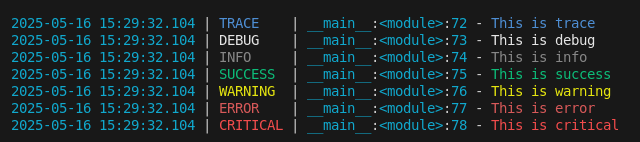

# colorog

[](https://pypi.org/project/colorog)
[](https://pypi.org/project/colorog)
[](https://github.com/termcolor/termcolor/actions)
[](LICENSE.txt)
[](https://github.com/psf/black)



## Installation

### From PyPI

```bash
python3 -m pip install --upgrade colorog
```

### Demo

To see demo output, run:

```bash
python3 -m colorog
```

## Example

```python
from colorog import log_info, log_success

log_info("This is info")
log_success("This is success")
# ...
```
